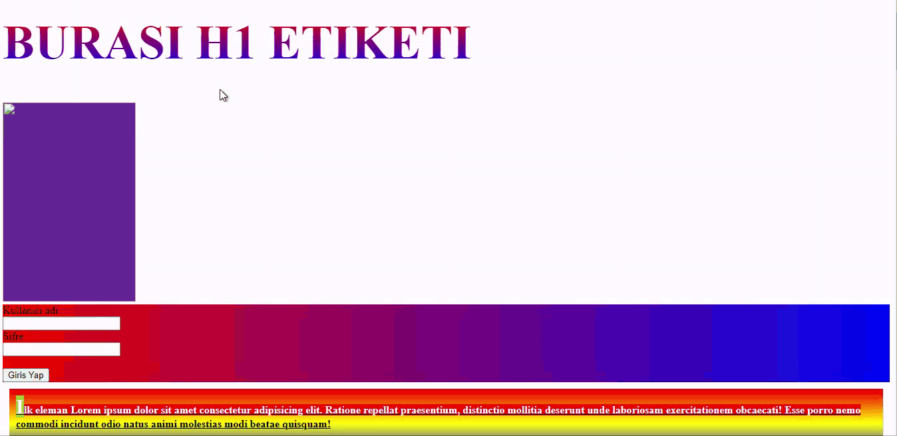

<h1>Grid, Gradient and Flex Test</h1>

In this project, I aimed to use some of the versatile and rather fundamental features of CSS. Grid display, gradient coloring and flex display.

<h2>GIF of the project</h2>

